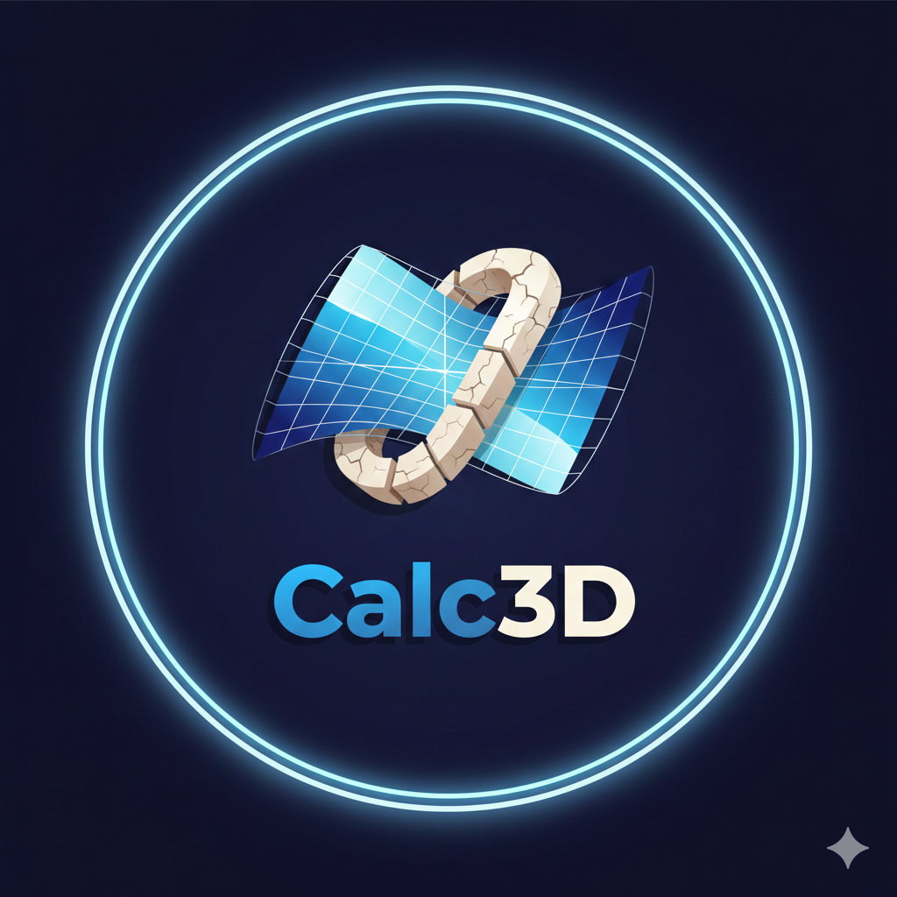

# Calc3D - Calculadora de Costes de Impresión 3D 🖨️

**Calc3D** es una aplicación web moderna diseñada para entusiastas y profesionales de la impresión 3D. Permite calcular con precisión los costes de tus impresiones, gestionar tus filamentos e impresoras, y guardar presupuestos para tus clientes.



## ✨ Características Principales

*   **Calculadora de Costes Precisa**: Ten en cuenta el peso del material, el coste de la electricidad, el tiempo de impresión y tu margen de beneficio.
*   **Gestión de Inventario**:
    *   **Impresoras**: Base de datos integrada con más de **40 modelos populares** (Creality, Bambu Lab, Prusa, etc.) con especificaciones técnicas predefinidas.
    *   **Filamentos**: Base de datos con más de **30 marcas** (Esun, Sunlu, Polymaker...) y gestión de colores, materiales (PLA, PETG, ABS...) y costes.
*   **Gestión de Presupuestos**: Guarda tus cálculos, consulta el historial y **imprime presupuestos** profesionales directamente desde la aplicación.
*   **Interfaz Moderna**: Diseño limpio y responsivo con **Tema Oscuro/Claro** y animaciones fluidas.
*   **Modo Invitado y Registro**: Prueba la aplicación sin compromiso o regístrate (simulado) para guardar tus datos.

## 🛠️ Tecnologías Utilizadas

*   **Frontend**: [React](https://react.dev/) + [TypeScript](https://www.typescriptlang.org/)
*   **Build Tool**: [Vite](https://vitejs.dev/)
*   **Estilos**: [Tailwind CSS](https://tailwindcss.com/)
*   **Iconos**: [Lucide React](https://lucide.dev/)
*   **Estado**: [Zustand](https://docs.pmnd.rs/zustand/getting-started/introduction) (con persistencia en LocalStorage)
*   **Animaciones**: [Framer Motion](https://www.framer.com/motion/)

## 🚀 Cómo Iniciar el Proyecto

### Requisitos Previos

*   Node.js (v18 o superior)
*   npm

### Instalación Local

1.  Clona el repositorio:
    ```bash
    git clone https://github.com/tu-usuario/calc3d.git
    cd calc3d
    ```

2.  Instala las dependencias:
    ```bash
    npm install
    ```

3.  Inicia el servidor de desarrollo:
    ```bash
    npm run dev
    ```

4.  Abre tu navegador en `http://localhost:5173`.

### Ejecución con Docker (Sin instalar Node.js)

Si prefieres no instalar dependencias en tu máquina, puedes usar Docker:

1.  Construir e iniciar el contenedor:
    ```bash
    docker run --rm -p 5173:5173 -v "%cd%:/app" -w /app node:24-alpine npm run dev -- --host
    ```

## 📄 Licencia

Este proyecto está bajo la Licencia MIT. Siéntete libre de usarlo y modificarlo.

---
**Calc3D** - Tu compañero indispensable para el negocio de impresión 3D.
